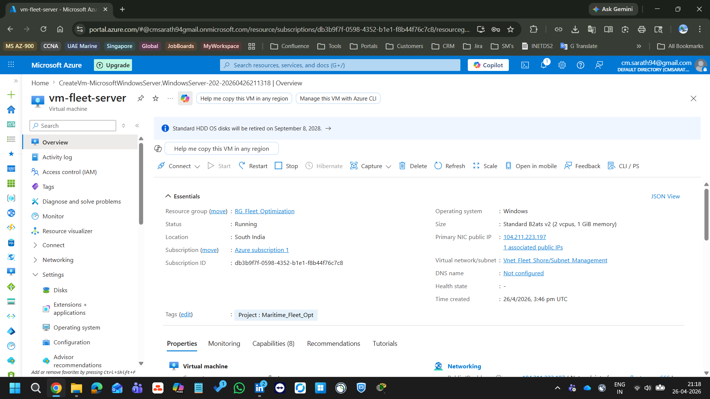
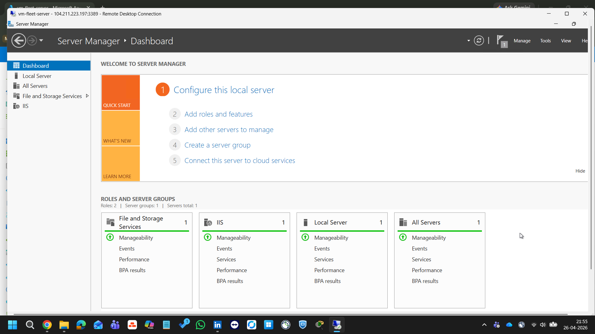
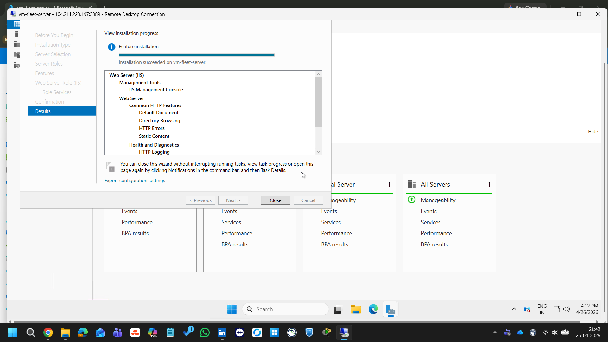
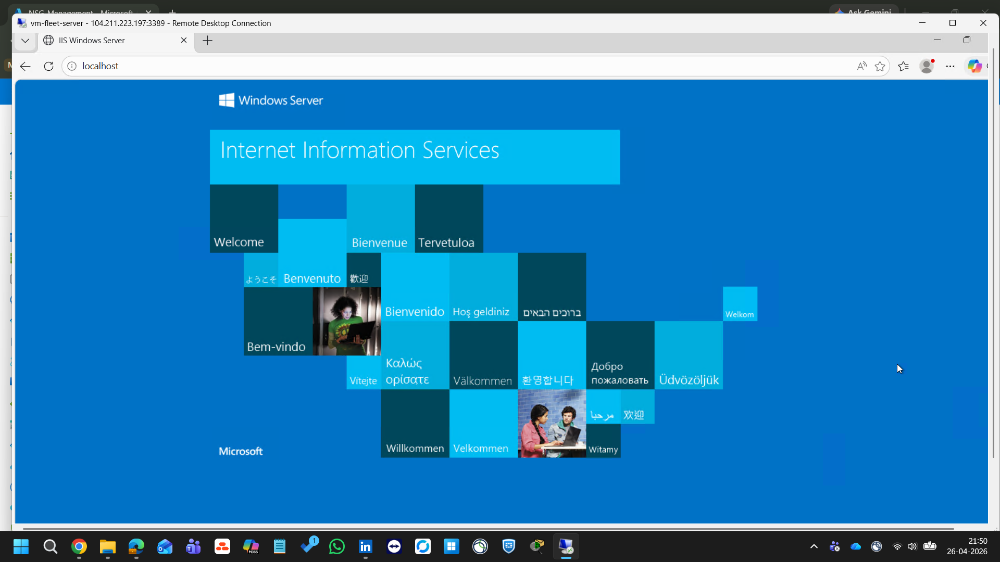
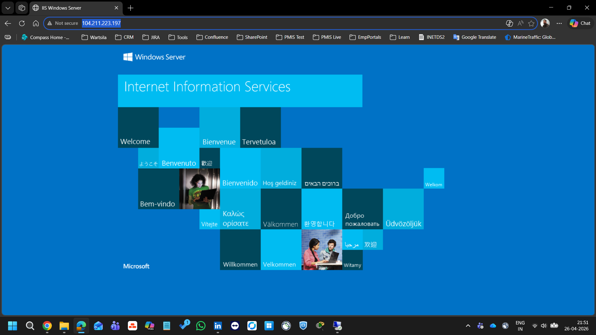

# 🖥️ Azure Windows VM + IIS Web Server Lab

---

## 🌐 Live Demo
IIS Web Server accessible at:
http://[104.211.223.197]
*(VM deleted after lab to save credits)*

---

## 🧩 Business Scenario

A maritime company needs a shore-based server to run 
fleet management software. Instead of buying physical 
hardware, we provision a Windows Server Virtual Machine 
on Azure — same capability at a fraction of the cost.

---

## 🏗️ Architecture
Internet
│
▼
Public IP (Port 80)
│
▼
NSG-Management (Allow HTTP port 80)
│
▼
Subnet-Management (10.0.5.0/24)
│
▼
VM-Fleet-Server (Windows Server 2022)
│
▼
IIS Web Server (localhost:80)

---

## ⚙️ Azure Resources Used

| Resource | Details |
|----------|---------|
| **Virtual Machine** | vm-fleet-server |
| **OS** | Windows Server 2025 Datacenter |
| **Size** | Standard B2s |
| **Region** | South India |
| **Virtual Network** | VNet-Fleet-Shore |
| **Subnet** | Subnet-Management |
| **NSG** | NSG-Management |
| **Public IP** | vm-fleet-server-ip |

---

## 🛠️ Steps Performed

### 1. VM Deployment
- Created Windows Server 2025 VM via Azure Portal
- Selected B2s size for cost efficiency
- Connected to existing VNet-Fleet-Shore
- Enabled auto-shutdown

### 2. IIS Installation via Server Manager
- Opened Server Manager inside VM via RDP
- Added Web Server (IIS) role
- Installed with default role services
- Verified IIS running on localhost

### 3. Network Security Group
- Added inbound rule on NSG-Management
- Opened port 80 for HTTP traffic
- Tested from local browser successfully

---

## 🔒 Security Considerations

- RDP port 3389 open for admin access (lab only)
- In production use **Azure Bastion** instead
- HTTP only — HTTPS requires domain name + SSL certificate
- For HTTPS on VM: need domain + Win-ACME certificate
- **Azure App Service** provides HTTPS automatically (PaaS advantage)

---

## 💡 IaaS vs PaaS — Real World Comparison

| Feature | Azure VM (IaaS) | App Service (PaaS) |
|---------|----------------|-------------------|
| HTTPS | Manual setup | Automatic |
| SSL Certificate | You manage | Azure manages |
| OS Updates | You manage | Azure manages |
| Scaling | Manual | Automatic |
| Cost | Pay per hour | Pay per plan |
| Control | Full | Limited |

---

## 💰 Estimated Cost

| Resource | Cost |
|----------|------|
| VM (B2s) ~2 hours | ~$0.05 |
| Public IP | ~$0.00 |
| **Total** | **~$0.05** |

*VM deleted after lab to avoid ongoing charges*

---

## 📸 Screenshots

| # | Screenshot | Description |
|---|-----------|-------------|
| 01 |  | VM overview in portal |
| 02 |  | Windows Server desktop via RDP |
| 03 |  | IIS installation via Server Manager |
| 04 |  | IIS welcome page inside VM |
| 05 |  | IIS accessible from internet |

---

## 💡 What I Learned

- Azure VMs are IaaS — full control but full responsibility
- Windows Server 2025 on Azure works exactly like physical server
- IIS installation via Server Manager same as on-premise
- NSG rules control internet access to VM
- HTTPS on VM requires domain + SSL certificate
- PaaS (App Service) handles SSL automatically — key advantage

---

## 🔁 CCNA to Azure Mapping

| CCNA Concept | Azure Equivalent |
|-------------|-----------------|
| Physical server | Azure Virtual Machine |
| Server NIC | Virtual Network Interface |
| VLAN | Subnet |
| ACL | NSG Rules |
| Static IP | Public IP Address |

---

## 📚 References
- [Azure VM Documentation](https://learn.microsoft.com/en-us/azure/virtual-machines/)
- [IIS Documentation](https://learn.microsoft.com/en-us/iis/)
- [Azure NSG Documentation](https://learn.microsoft.com/en-us/azure/virtual-network/network-security-groups-overview)