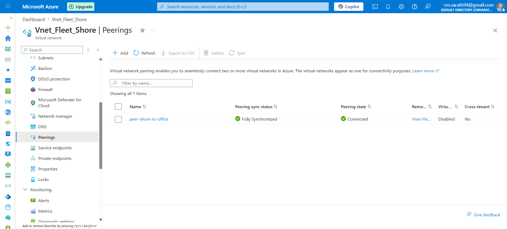
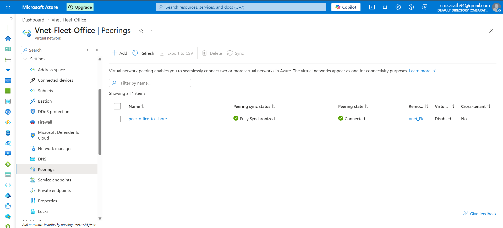

# 🔗 Azure VNet Peering Lab
## Private Network Connectivity Between Two VNets

---

## 🧩 Business Scenario

A maritime company runs two separate Azure environments:

- **VNet-Fleet-Shore** — Fleet monitoring and vessel tracking
- **VNet-Fleet-Office** — Back office HR and admin systems

Both systems need to communicate privately without
going through the internet — just like connecting two
office branches via a private leased line.

---

## 🏗️ Architecture

```
VNet-Fleet-Shore          VNet-Fleet-Office
10.0.0.0/16               10.1.0.0/16
                                    
┌──────────────┐          ┌──────────────┐
│ Subnet-GW    │          │Subnet-Office │
│ 10.0.1.0/24  │          │10.1.1.0/24   │
│              │          │              │
│ Subnet-WebAPI│◄────────►│              │
│ 10.0.2.0/24  │  Peering │              │
│              │  (Azure  │              │
│ Subnet-DB    │  backbone│              │
│ 10.0.4.0/24  │          │              │
└──────────────┘          └──────────────┘
```

---

## ⚙️ Azure Resources Used

| Resource | Details |
|----------|---------|
| **VNet 1** | VNet-Fleet-Shore (10.0.0.0/16) |
| **VNet 2** | VNet-Fleet-Office (10.1.0.0/16) |
| **Peering 1** | Peer-Shore-to-Office |
| **Peering 2** | Peer-Office-to-Shore |
| **Region** | South India |

---

## 🛠️ Steps Performed

### 1. Created Second VNet
- VNet-Fleet-Office with address space 10.1.0.0/16
- Subnet-Office 10.1.1.0/24
- Same region as VNet-Fleet-Shore

### 2. Configured Peering
- Added peering from VNet-Fleet-Shore to VNet-Fleet-Office
- Azure automatically created reverse peering
- Both sides confirmed Connected status

---

## 💡 Key Concepts

### VNet Peering vs VPN Gateway

| Feature | VNet Peering | VPN Gateway |
|---------|-------------|-------------|
| Speed | Fast | Slower |
| Cost | Low | Higher |
| Setup | Simple | Complex |
| Traffic | Azure backbone | Encrypted tunnel |
| Use case | Azure to Azure | On-premise to Azure |

### Non-Transitive Peering

```
VNet-A ◄──► VNet-B ◄──► VNet-C

VNet-A CANNOT reach VNet-C
unless directly peered!

This is non-transitive peering.
```

---

## 💰 Estimated Cost

| Resource | Cost |
|----------|------|
| VNet Peering (same region) | ~$0.01/GB transferred |
| Lab data transfer | ~$0.00 |
| **Total** | **~$0.00** |

---

## 📸 Screenshots

| # | Screenshot | Description |
|---|-----------|-------------|
| 01 |  | Peering on VNet-Fleet-Shore |
| 02 |  | Peering on VNet-Fleet-Office |

---

## 💡 What I Learned

- VNet Peering connects two VNets privately via Azure backbone
- Peering is non-transitive — no automatic chaining
- Both sides must show Connected for traffic to flow
- Regional peering = same region, Global peering = different regions
- Much simpler and cheaper than VPN Gateway for Azure to Azure

---

## 🔁 CCNA to Azure Mapping

| CCNA Concept | Azure Equivalent |
|-------------|-----------------|
| Private leased line | VNet Peering |
| OSPF neighbour | Peering connection |
| Route redistribution | Traffic forwarding in peering |
| Non-transitive routing | Non-transitive peering |

---

## 📚 References
- [VNet Peering Documentation](https://learn.microsoft.com/en-us/azure/virtual-network/virtual-network-peering-overview)
